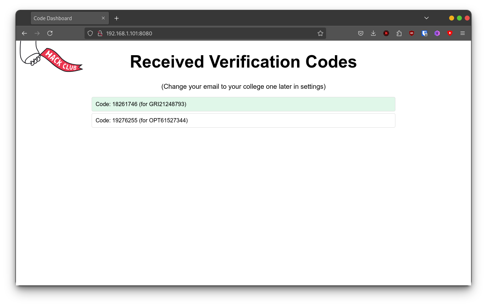

# Verily

Hi! This project is a simple, containerised python service to forward emails for Runshaw Hack Club. We use this because Github has banned our college emails from signing up, so we have this service to show a live display of github email verification codes. It works by:
- Setting up a simple email server
- Reading received emails and checking the from address
- Using regex to extract the verification code
- Displaying the verification code on a webpage via a websocket

## High Seas reviewer?
To try out this project, go to github.com/signup and use the email `test@mail.danieldb.uk`. You should see the verification code appear on the webpage. Don't actually enter the code though!

## Setup
1. Clone the repository
2. Run `docker-compose up -d`
3. Visit `localhost:8080` to see the verification codes

## Usage
- The email server is running on port 25
- The websocket server is running on port 8080
- Ensure you have a MX record pointing to the server, and that port 25 is forwarded